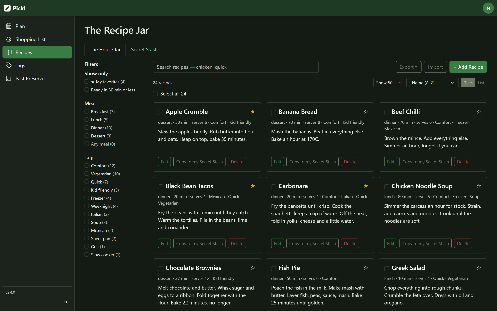
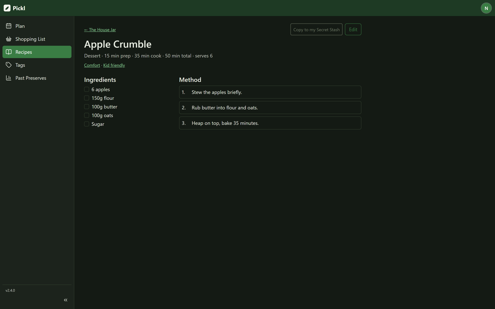
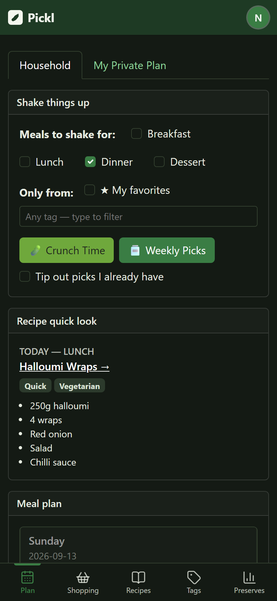
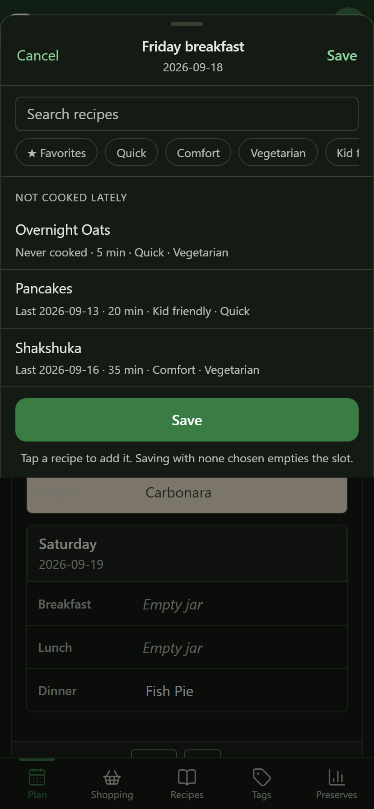

# Pickl

> **Out of the pickle, onto the plate.**

A self-hosted web app for a household's recipes and weekly meal plan. One
shared recipe jar and calendar for the family, a private one for each person,
and a button that decides dinner when nobody can.

Next.js 14 (App Router, TypeScript) · SQLite via Drizzle ORM · Auth.js
credentials with email verification · react-bootstrap.


*`/plan` — drag, resize or hide any widget; the arrangement is saved per user.*

## What it does

**Plan the week.** A Sunday–Saturday grid you fill by tapping a slot, or by
letting the app choose: **🥒 Crunch Time** picks for today, **🫙 Weekly Picks**
fills the rest of the week. Either can be limited to your starred recipes and
to chosen tags. Days that have passed are dimmed and read-only, so the history
the reports read stays true.

**Keep the recipes.** A shared House Jar plus a Secret Stash only you can see,
with server-side search (several terms separated by commas must all match),
filters for meal, tags, favorites and quick recipes, sorting by name, newest or
plan history, and paging that stays fast at thousands of recipes. Select many
at once to tag, copy between jar and stash, or delete. Import a pasted recipe
or a whole file; export everything or just what a search found.

**Cook from it.** Each recipe has its own page: ingredients you can tick off,
the method as numbered steps, and the step you're on kept while the tab is
open.

**Shop from it.** The week's ingredients as a checklist, per recipe, with text
or CSV download — on the plan dashboard and on its own screen.

**Mirror it into your calendar.** Planned meals can be pushed to Google
Calendar or any CalDAV server, and your own events can be drawn beside the
plan. See [docs/calendars.md](docs/calendars.md).

**Look back.** Past Preserves reports what was planned — meal history, recipe
frequency, patterns, and an audit log — with CSV export.

| The recipe jar | A recipe, to cook from |
| --- | --- |
|  |  |

| On a phone | Choosing a meal |
| --- | --- |
|  |  |

The picker suggests your favorites and recipes you haven't cooked lately before
you type anything, and each row says when it was last cooked and how long it
takes.

## Roles & permissions

| | Shared recipes | Shared calendar | Own private recipes & calendar | Other people's |
| --- | --- | --- | --- | --- |
| **Member** | view | view; edit if an admin allows it | full | none |
| **Admin** | full | full | full | can view and edit private calendars |
| **Global admin** | full | full | full | as admin; role and active status can never be changed |

- The **first account ever created** becomes an admin and the permanent
  **global admin** (`isGlobalAdmin`), so the system always has at least one
  admin. Everyone after that signs up as a member.
- A member's access to *edit* the shared calendar is a per-user switch
  (`canAccessSharedCalendar`); everyone can view it. Deactivated accounts are
  refused at login.
- Every rule is enforced server-side in the API routes — see
  `src/lib/permissions.ts` and `src/lib/planContext.ts` — not just hidden in
  the UI.

Manage people at **`/admin`** ("Back of House"), where admins can also add a
user directly (with a temporary password shown once) or send an email invite
that expires in 24 hours.

## Preferences

`/preferences` is self-service only: each route acts on the caller's own
record. It covers the display name, the login email (confirmed from the new
address, so a typo can't lock anyone out), the password, calendar connections,
light/dark mode, one of six colour palettes, and which tag chips the recipe
picker offers.

Light/dark and the palette are applied before first paint, so the page never
flashes the wrong theme. "Today" is worked out in the browser's own time zone,
so an evening in one zone and a server in another still agree on what day it
is.

## Deploying

The published image is `ghcr.io/wallacegsr/pickl:latest` (also tagged per
release). A minimal stack:

```yaml
services:
  pickl:
    image: ghcr.io/wallacegsr/pickl:latest
    restart: unless-stopped
    ports: ["3000:3000"]
    volumes: ["pickl-data:/data"]
    environment:
      NEXTAUTH_SECRET: "generate-with-openssl-rand-base64-32"
      NEXTAUTH_URL: "https://pickl.example.com"
      APP_BASE_URL: "https://pickl.example.com"
      DATABASE_PATH: "/data/app.db"
volumes:
  pickl-data:
```

`NEXTAUTH_URL` and `APP_BASE_URL` must be the URL people actually open: they
sign the session, build email links, and form the Google OAuth redirect. The
container applies pending migrations on startup, so a new image is a pull and
a restart — **back up `app.db` first**, as a migration can rewrite a table.

Full notes on Portainer, NAS bind mounts, reverse proxies and storage:
[docs/deployment.md](docs/deployment.md).

## Local development

Node.js 20+ (24 works). `better-sqlite3` builds a native addon, so Windows
needs Python 3.10+ and the "Desktop development with C++" workload; macOS and
Linux need the usual build tools. Keep `better-sqlite3` on v12 — v11 crashes
on Node 24, and v13+ needs Node 22, which the `node:20` Docker base image
isn't.

```bash
npm install
cp .env.example .env.local   # fill in the values below
npm run dev                  # http://localhost:3000
```

The database is created on first use and migrations are applied automatically.

| Variable | What it's for |
| --- | --- |
| `NEXTAUTH_SECRET` | Signs session JWTs. `npx auth secret` or `openssl rand -base64 32`. |
| `NEXTAUTH_URL` | Where the app is served, e.g. `http://localhost:3000`. |
| `APP_BASE_URL` | Base for email links and the Google OAuth redirect. Usually the same. |
| `DATABASE_PATH` | SQLite file. Defaults to `./data/app.db`. |
| `SMTP_HOST` / `PORT` / `USER` / `PASS` / `FROM` | Fallback mail settings, used only when none are saved in `/admin`. With neither, verification links are logged to the console — which is what you want locally. |

| Script | Purpose |
| --- | --- |
| `npm run dev` | Dev server. |
| `npm run build` | Production build, including type checking. |
| `npm start` | Applies migrations, then serves the build. |
| `npm run db:generate` | Generate a migration from `src/db/schema.ts`. |
| `npm run db:migrate` | Apply pending migrations to `DATABASE_PATH`. |
| `npm run db:seed` | A few sample recipes. Safe to re-run. |

`src/db/index.ts` hands out the database as a lazy proxy rather than
connecting at import time — `next build` imports every route module, and an
eager connection opened a handle (and ran migrations) in each build worker.
Keep imports of that module side-effect free.

## More

- [docs/calendars.md](docs/calendars.md) — Google and CalDAV sync, reading
  events back onto the plan, and the trust boundary around them.
- [docs/deployment.md](docs/deployment.md) — Docker, Portainer, NAS bind
  mounts, ports, reverse proxies, storage.
- [docs/architecture.md](docs/architecture.md) — the dashboard widgets, how
  migrations run, and the shape of the source tree.
- [CHANGELOG.md](CHANGELOG.md) — what changed, per release.
- [SECURITY.md](SECURITY.md) — reporting a vulnerability.

An Android wrapper lives in `android/`; its `versionName` is kept in step with
`package.json`, and the version showing in the sidebar is the one running.

## Licence

[MIT](LICENSE).
