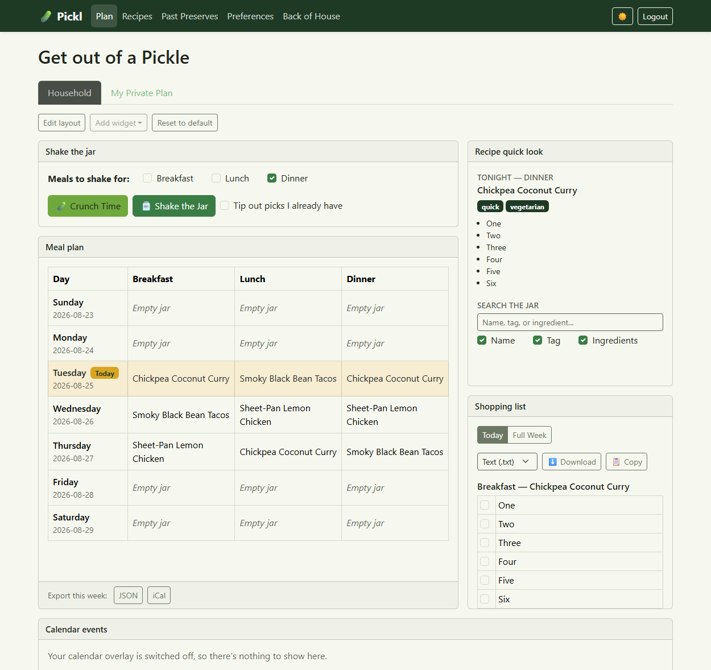

# Pickl

> **Out of the pickle, onto the plate.**

A household web app for a shared recipe box and weekly meal plan, with
per-user private recipes and calendars layered on top. Built with Next.js 14
(App Router, TypeScript), SQLite via Drizzle ORM, Auth.js (NextAuth v5)
credentials auth with email verification, and react-bootstrap for the UI.

Every household member shares a login system and (optionally) a household
calendar/recipe pool, but each user can also keep their own private recipes
and their own private meal calendar that nobody else can see (admins
excepted — see below). Signup requires email verification before an
account can log in.



*The `/plan` dashboard — drag, resize or hide any widget; the arrangement is saved per user.*

## Roles & permissions

- The very **first account ever created** automatically becomes an
  **admin** (bootstraps the system — there's no admin until someone signs
  up) **and** the permanent **global admin** — a flag (`isGlobalAdmin` on
  the `users` table) fixed forever at that moment, never granted or
  revoked afterward. There is exactly one global admin, always. Every
  signup after that defaults to the **member** role.
- **Admins** can manage everything: promote/demote other admins, verify/
  deactivate/reactivate accounts, toggle a member's access to the shared
  household calendar, and create/edit/delete **shared** recipes. Admins
  can also view and edit any user's **private** calendar.
- The **global admin**'s role and active status can never be changed by
  anyone (including other admins) — the admin API rejects those requests
  server-side with a clear error, and the `/admin` UI hides/disables the
  promote-demote and activate-deactivate controls on their row. This
  guarantees the system always has at least one admin, so there's no
  separate "can't demote/deactivate the last admin" rule to worry about —
  the global admin's permanence already covers it. Regular (non-global)
  admins can still freely promote/demote each other and can still toggle
  the global admin's shared-calendar-access flag, since that's a
  separate, lower-stakes setting.
- **Members** always have full access to their own private calendar and
  private recipes. Whether they can also *edit* the shared household
  calendar is controlled per-user by an admin (`canAccessSharedCalendar`
  on the `users` table) — everyone can always *view* it. Members cannot
  create, edit, or delete shared recipes, only view them.
- Deactivated accounts (`active = false`) are rejected at login with a
  clear error message.
- All of this is enforced **server-side** in the API route handlers (see
  `src/lib/permissions.ts` and `src/lib/planContext.ts`), not just hidden
  in the UI.

Manage roles, verification, activation, and shared-calendar access for
every user at **`/admin`** (admin-only). Admins can also add new users
there — see "Adding users" below.

The navbar labels `/admin` **Back of House** and `/reports` **Past
Preserves**. Because those names don't say what the pages hold, both nav
items (and the two recipe tabs, and the two pick buttons) carry hover text
that does.

## Adding users

Besides self-service `/signup`, an admin can add users directly from
**`/admin`** via the **"+ Add User"** button, in two ways:

- **Manual** — the admin types a name, email, role (Member/Admin — never
  Global Admin; there's no UI path to grant that), and a temporary
  password (or clicks "Generate" for a random one). The account is
  created already verified and active, so the new user can log in
  immediately with that password. The temporary password is shown back to
  the admin **once**, in a success banner, right after creation — it's
  hashed at rest and can't be retrieved again, so the admin needs to copy
  it and share it with the user directly.
- **Invite by Email** — the admin types a name, email, and role. The app
  creates a pending account (login is blocked until accepted — the
  account's password hash is set to an unusable random value) and emails
  an invite link (or logs it to the console if SMTP isn't configured, same
  as verification emails) to `/invite/accept?token=...`. The invitee opens
  the link, sets their own password, and is redirected to `/login` to sign
  in. Invite tokens live in dedicated `inviteToken`/`inviteTokenExpires`
  columns (separate from the self-signup `verificationToken` columns, to
  keep the two "pending account" flows unambiguous) and expire after 24
  hours, mirroring the verification-link flow.

## SMTP settings

SMTP (used to send verification, invite, and test emails) can be configured
two ways, which layer as a default + runtime override:

- **Environment variables** (`SMTP_HOST` / `SMTP_PORT` / `SMTP_USER` /
  `SMTP_PASS` / `SMTP_FROM`, set via `.env.local` locally or the
  Portainer/`docker-compose.yml` stack env vars in production) act as the
  **default/fallback** — useful to get real email working before any admin
  has logged in to configure it another way.
- **`/admin`'s "SMTP Settings" panel** (admin-only) lets an admin configure
  Host, Port, Username, Password, and From address at runtime, stored in
  the database (`app_settings` table). Once a **Host** is saved there, it
  **takes precedence** over the environment variables for all outgoing
  mail. Leaving Host blank there falls back to the environment variables
  (or console-logging, if neither is configured) — the same behavior as
  before this feature existed.
- The panel also has a **"Send test email"** button that sends a real test
  message using whatever is currently saved in the database, and surfaces
  the actual SMTP error (auth failure, connection refused, unknown host,
  etc.) if it fails — save your settings first, since it doesn't test
  unsaved form state.
- The stored password is **encrypted at rest** (AES-256-GCM) using a key
  derived from `NEXTAUTH_SECRET` (see `src/lib/crypto.ts`). It's never
  sent back to the browser in plaintext — the settings form shows a masked
  `••••••••` placeholder for an already-configured password, and leaving
  it blank on save keeps the existing password unchanged. **Because the
  encryption key is derived from `NEXTAUTH_SECRET`, changing
  `NEXTAUTH_SECRET` after SMTP settings have been saved will make the
  stored password undecipherable** — re-enter it from `/admin` if you ever
  rotate `NEXTAUTH_SECRET`.

## Calendar sync

Planned meals can be mirrored into a real calendar, so meals show up
alongside everything else in your day. Two providers are supported:

| Provider | Auth | Server-side setup |
| --- | --- | --- |
| **Google Calendar** | Per-user OAuth | An admin must register an OAuth client once (below) |
| **CalDAV** (Fastmail, iCloud, Nextcloud, Synology, Baikal, Radicale…) | Per-user username + app password over HTTPS | None |

A user can connect **either or both**, though each plan has at most one
target — so you might mirror the household plan to Google and your private
plan to Fastmail, but not one plan to both at once.

**No new environment variables are needed for either provider.** All
credentials are per-user rows in the database, encrypted at rest with the
existing `NEXTAUTH_SECRET`-derived key (`src/lib/crypto.ts`). The Google
OAuth *client* credentials are configured through the admin UI, not the
environment.

**Each user connects their own account** and mirrors the plans they
care about into a calendar of their own choosing. There is no app-owned or
admin-owned "household calendar" — the household plan is mirrored
separately into each participating person's calendar. So one user can have
up to two sync targets:

| Plan | What it mirrors |
| --- | --- |
| **Household plan** | The shared household plan, into a calendar of that user's choosing. |
| **My private plan** | That user's own private plan. |

Users manage all of this from **Preferences → Calendars**.

### Admin setup: the OAuth client (one-time, per deployment)

The only calendar setting an administrator owns is the Google OAuth
**client** credentials — deployment plumbing, the same category as SMTP.
Configured under **Admin → Calendar Integration**.

1. In the [Google Cloud console](https://console.cloud.google.com/),
   create (or pick) a project.
2. Enable the **Google Calendar API** for that project.
3. Create an **OAuth client ID** of type **Web application**.
4. Add this app's redirect URI to that client's *Authorized redirect
   URIs*:

   ```
   {APP_BASE_URL}/api/calendar/google/callback
   ```

   The exact value is shown as copyable text on the admin panel, computed
   from this server's configured base URL — copy it from there rather than
   assembling it by hand.
5. Paste the **client ID** and **client secret** into the admin panel,
   tick **Enable Google Calendar sync**, and save.
6. On the **OAuth consent screen**, set the publishing status to **In
   production**. Read the warning below before skipping this.

> **⚠️ Leaving the consent screen in "Testing" expires everyone's
> authorization after about 7 days**, forcing every person in the
> household to reconnect weekly. Publishing to **In production** fixes it.
> For a private household app this does *not* mean going through Google's
> formal verification review — it just means each person accepts a
> one-time "Google hasn't verified this app" warning the first time they
> connect. If users keep seeing "Reconnect your Google account", this is
> almost always why.

#### The redirect URI must match your deployment's base URL

The redirect URI is derived from `APP_BASE_URL` (falling back to
`NEXTAUTH_URL`). Whatever those are set to **must** match the URL people
actually visit *and* the URI registered in Google Cloud, or Google rejects
every connection attempt with `redirect_uri_mismatch`. If you move the app
to a new hostname, update the env var *and* add the new redirect URI in
Google Cloud.

### Connecting a Google account (each user, from Preferences → Calendars)

1. Click **Connect Google Calendar** and complete Google's consent screen.
2. Pick a target calendar for the **Household plan**, the **My private
   plan**, or both — or leave either on **Don't sync**.
3. Optionally tick **include recipe details** per target, and use **Sync
   now** to reconcile the current week.

The app requests the narrowest scopes that do the job:
`calendar.events` (manage the events it creates), `calendar.calendarlist.readonly`
(so you can pick which of your calendars to target), and `openid email`
(to label the connection). Notably it does **not** request the broad
`calendar` scope.

`calendar.events` covers both writing meals out and — only if you opt in
to the overlay below — reading that week back. Turning the overlay on
therefore needs **no re-consent and no new scopes**; nobody who has already
connected has to reauthorize.

### Connecting a CalDAV server (each user, from Preferences → Calendars)

1. Enter your **server URL**, **username** and **app password**, then
   click **Connect**. Pickl performs RFC 6764 service discovery (well-known
   URL → principal → calendar home) and lists the calendars on that account
   that can hold events.
2. Pick a target calendar per plan, exactly as with Google.

Where to find the URL, and which providers force an app password:

| Provider | CalDAV URL | Password |
| --- | --- | --- |
| Fastmail | `https://caldav.fastmail.com/` | **App password required** — Settings → Privacy & Security → Integrations → App passwords, with CalDAV access |
| iCloud | `https://caldav.icloud.com/` | **App-specific password required** — account.apple.com → Sign-In and Security. Username is your Apple ID email |
| Nextcloud | `https://your-server/remote.php/dav/` | Account password works; use a device password (Settings → Security) instead |
| Synology Calendar | `https://your-nas:5001/caldav/` | Your DSM account |

Two rules worth knowing before you type anything in:

- **Use an app-specific password, never your main account password.**
  CalDAV authenticates with HTTP Basic, so the password has to be stored in
  a recoverable (encrypted, not hashed) form to be replayed on every
  request. Give Pickl a credential you can revoke on its own. iCloud and
  Fastmail require one anyway.
- **HTTPS only.** A plain `http://` server URL is rejected outright,
  because Basic auth would put your password on the wire in the clear. The
  single exception is a loopback host (`localhost`, `127.0.0.1`, `::1`) in
  a *non-production* build, so a local CalDAV server can be tested without
  minting certificates — it is off in the Docker image, which runs with
  `NODE_ENV=production`, and needs no environment variable to keep it that
  way.

Pickl also refuses server URLs that resolve to private, loopback or
link-local addresses (RFC1918, CGNAT, IPv6 ULA, `169.254.0.0/16` and
friends), and re-checks that on every redirect hop, because the server is
fetching a URL the user supplied. See `src/lib/calendar/caldavUrl.ts`.

**Disconnecting** deletes the stored server address and encrypted
password along with any targets using them. There is nothing to revoke
remotely — revoke the app password in your provider's own settings.

### What gets pushed

- Events are **title only by default** — e.g. `Dinner: Spaghetti
  Bolognese`. Ingredients and instructions never leave the app unless the
  user ticks **"Include recipe details"** on that specific target.
- Event times reuse the same per-meal default hours as the iCal export
  (breakfast 08:00, lunch 12:00, dinner 18:00, 1 hour long), so pushed
  events line up with exported ones.
- Pushes happen automatically whenever a meal is planned, changed, or
  cleared — every plan write goes through `setPlanEntry`, the single write
  path. A **private** write reaches only its owner's private target; a
  **household** write **fans out** to every user who has an enabled
  household target.
- Because a full-week shake in a four-person household is now dozens of
  writes, pushes are not fired unthrottled: targets run in parallel and
  each target's own work is capped at a small concurrency limit. Google's
  batch endpoint is deliberately *not* used — every target authenticates
  as a different user, so a single batch could not span the fan-out
  anyway.
- **A calendar outage can never break meal planning.** The push is
  detached from the request and fully non-fatal: if Google is down, a
  CalDAV server is unreachable, or a stored credential has stopped
  working, the shake/edit still succeeds and the
  failure is recorded per target in `lastSyncError`, shown on that user's
  Preferences → Calendars panel. **Sync now** is the recovery path — it
  reconciles the whole current week for one target.
- A `calendar_event_links` row maps each (target, date, meal) to the event
  the provider holds, so re-planning a meal **updates** that event rather
  than creating duplicates. If the event has been deleted in Google
  Calendar, the next push creates a fresh one.
- For CalDAV there is no server-assigned event id: the resource URL is
  derived from a **stable UID** hashed from (target, date, meal). So even
  if a link row is lost — an older backup, say — the next push addresses
  the same resource and overwrites it instead of double-booking the meal.
- CalDAV writes are **conditional** (`If-Match` / `If-None-Match`) using
  the ETag from the last write. An event you edited by hand in your own
  calendar app is still *updated* when the plan changes (the plan is the
  source of truth for what is scheduled), but it is **never deleted** out
  from under you: clearing that slot reports the conflict in
  `lastSyncError` and leaves your edited event alone.
- Every CalDAV request carries a hard timeout, and a whole discovery walk
  shares one budget, so a hung server cannot hold a request open or leak
  an unsettled promise into the detached push path.
- **Disconnect** deletes the stored authorization, both sync targets and
  all event links, and (for Google) **revokes the refresh token** so a
  stolen database backup cannot be replayed later. It deliberately **leaves
  already-created events in the remote calendar** — silently wiping a month of
  someone's calendar would be surprising. Delete them yourself if you want
  them gone.
- Turning **Sync enabled** off on a target keeps it configured but stops
  all pushes to it.

## Calendar read-back (seeing your own events on the plan)

Sync pushes meals *out*. Read-back brings the rest of your week *in*: with
it switched on, the plan grid grows one more column — **On your
calendar** — showing your own events beside the meal slots, so you can see
the soccer practice before you plan a roast.

It is **off by default** and each person turns it on for themselves under
**Preferences → Calendars → Show my calendar on the plan**.

- **Google Calendar only, for this release.** CalDAV connections still
  receive your meals; they cannot be read back yet. Doing it properly needs
  a `calendar-query` REPORT plus client-side recurrence expansion, and a
  half-correct implementation would quietly show people the wrong week. The
  CalDAV provider therefore reports "not supported" explicitly, and a
  CalDAV-only user sees a one-line explanation instead of an error.
- **Events are never stored.** Not titles, not times, not attendees — no
  external event data reaches the database in any table. Each request
  fetches the displayed week, renders it, and drops it. The only retention
  is a ~60-second in-memory cache, keyed by user, calendar and week, that
  dies with the process. Event titles are never written to the log either.
- **The overlay is per-viewer, never shared.** The household plan is
  shared; the events drawn on it are not. Two people looking at the same
  household week each see their own calendar and never each other's.
- **Administrators get nothing extra.** An admin may view a member's
  private plan, but that view carries no calendar overlay at all — enforced
  server-side in `src/lib/calendar/read.ts`, not merely hidden in the UI.
- **Opting out stops the reading, not just the drawing.** With the switch
  off, no request is made to any calendar provider.
- **Pickl's own pushed meals are filtered out** so a planned dinner never
  appears twice — once as a meal slot and once as an "event". Three signals
  do it: a private extended property Pickl writes on every event it
  creates, the `pickl-` UID prefix used by CalDAV-pushed events, and the
  event ids in `calendar_event_links` for that viewer's own targets.
- **Recurring events are expanded by Google** (`singleEvents=true`) rather
  than by us. All-day and multi-day events are handled as such; a
  three-day trip shows on all three days.
- **A failed read can never break the plan.** The grid is rendered by the
  server without waiting on any calendar; the overlay is fetched afterwards
  and dropped in when it arrives. If the read fails, times out (5s hard
  ceiling) or the stored token is dead, the grid still renders in full and
  the only symptom is a quiet inline line — "Couldn't load your calendar
  events." A dead token reuses the **existing** reconnect signal that the
  push path already sets, so you get one "Reconnect your Google account"
  banner rather than two competing ones.

### Trust boundary

- **Administrators cannot see or operate another user's calendar
  connection** — not in the UI, and not through any API. There is
  deliberately no admin override: every calendar endpoint derives the
  owner from the server-side session and never accepts a user id from the
  client, and the data-access helpers in `src/lib/calendar/accounts.ts`
  all scope their queries by that user id. The same holds for CalDAV: the
  stored server password is decrypted only inside the outbound request
  path and is never returned by any endpoint — the settings API exposes a
  `hasPassword` boolean, and leaving the field blank keeps the saved one.
  Per-user credentials are the main reason the app moved off a shared
  service account in the first place.
- **Refresh tokens, CalDAV passwords and the OAuth client secret are all
  encrypted at rest**
  (AES-256-GCM, same mechanism as the SMTP password — see
  `src/lib/crypto.ts`) and are never sent back to the browser in any form,
  masked or otherwise. The admin form shows a placeholder when a secret is
  stored, and leaving it blank on save keeps the existing one.
- Be clear-eyed about what that protects against: **an admin who controls
  the deployment or the database file can inherently reach the stored
  credentials.** Encryption at rest protects the DB file at rest; the
  app-level rules prevent casual in-app access. Neither stops a determined
  operator of the server.
- The OAuth `state` parameter is cryptographically random, bound to the
  initiating session's user, stored server-side, **single-use** and
  short-lived. A callback whose state is missing, unknown, expired,
  already consumed, or minted for a different user is rejected before the
  authorization code is ever exchanged — so a callback can never attach a
  Google account to a user who did not start the flow.
- `audit_log` records connect / disconnect / target changes and manual
  syncs. It never records tokens, client secrets, or event contents.
- **Rotating `NEXTAUTH_SECRET` breaks decryption of the stored refresh
  tokens and OAuth client secret**, exactly as it does for the stored SMTP
  password, since the encryption key is derived from it. After rotating,
  the admin must re-enter the client secret and every user must reconnect
  their Google account from Preferences → Calendars.

## Private calendars & private recipes

- `/plan` has a **Household** / **My Private Plan** tab. Household is the
  shared calendar (editable by admins and by members granted shared
  access, read-only for everyone else). My Private Plan is scoped to the
  logged-in user only — admins additionally get a user picker to view or
  edit any other member's private plan.
- `/recipes` (**The Recipe Jar**) has a **The House Jar** / **Secret Stash**
  tab. The House Jar is the shared, household-wide set —
  admin-managed (members can view but not edit); Secret Stash is full CRUD
  for the owner only, regardless of role.
- Shaking a recipe into the **household** calendar draws only from shared
  recipes. Shaking into a **private** calendar draws from shared recipes
  *plus* that user's own private recipes.

## The /plan dashboard

`/plan` is a **configurable dashboard**: a board of draggable, resizable
widgets whose arrangement is saved per user. The page chrome around it —
the Household / My Private Plan tabs and the admin's "viewing calendar for"
picker — is *not* a widget, because those decide what the whole board is
showing and must never be something you can accidentally hide.

The default arrangement is a wide left column for the week itself and a
narrow right column for what you consult while planning it:

```
  Shake the jar  (8 wide) │ Recipe quick look (4 wide)
  Meal plan      (8 wide) │ Shopping list     (4 wide)
  Calendar events        (full width)
```

Shaking sits directly above the grid it fills in. Default widget heights are
measured against real content rather than guessed, so nothing starts with a
lap of empty space — the shopping list is the deliberate exception, since a
full week of ingredients would otherwise push everything else off screen, so
it scrolls instead.

**Export lives in the Meal plan widget**, as a footer pinned below its
scrolling body. The buttons export whatever week and scope the grid is
showing, so they belong to it. One consequence worth knowing: hide that
widget and the export buttons go with it.

### The widgets

| Widget | What it is |
| --- | --- |
| **Meal plan** | The Sunday–Saturday grid, including the "On your calendar" overlay column. Click a cell to edit that slot. |
| **Shake the jar** | The meal checkboxes plus 🥒 Crunch Time and 🫙 Shake the Jar, with their animations and hover hints. |
| **Shopping list** | The Today / Full Week ingredient checklist, with download and copy. |
| **Recipe quick look** | Tonight's dinner and its ingredients, plus a search box over the recipe pool. Deliberately compact — it's a glance, not a second `/recipes`. |
| **Calendar events** | This week's external calendar events as a list. Same opt-in and privacy rules as the grid's overlay column (see below). |

The registry that defines them lives in `src/lib/dashboard/widgets.ts`
(ids, titles, default geometry, size minimums) with the id → component map
in `src/components/plan/WidgetFrame.tsx`. Adding or removing a widget is an
edit to those two places and needs no data migration.

All five widgets read one shared state, held in `PlanView` and passed down
through `src/components/plan/PlanContext.tsx`. That is why the grid and the
Calendar events widget never issue two calendar requests, and why the
shopping list still refreshes the moment a shake lands: the widgets are
views over the page's data, not independent fetchers.

### Add, hide, reorder

**Edit layout** reveals per-widget controls; **Add widget** offers anything
not currently on the board.

**Hiding a widget deletes nothing.** It removes a view. Meals, ticked
ingredients, recipes and calendar connections are all untouched, and adding
the widget back restores it exactly as it was. The button is labelled
*Hide* rather than *Remove* for that reason.

Drag-and-drop is never the only way to work the board. Every widget's header
carries **↑** and **↓** buttons that swap it with its neighbour in reading
order, so the whole dashboard is operable from the keyboard; each widget is
also a labelled `role="region"` landmark. Dragging (by the title bar) and
resizing (by the bottom-right corner) are conveniences on top.

### How layouts persist

One row per user in a `dashboard_layouts` table, keyed by `user_id` as the
primary key, holding the arrangement as JSON. Reads and writes go through
`GET`/`PUT`/`DELETE /api/dashboard/layout`.

**The owner always comes from the session.** No verb on that route reads a
user id from the query string, body or headers — there is no admin view of
somebody else's board and no cross-user read, so passing `?userId=…` simply
returns your own layout. A user who has never rearranged anything has no
row at all and lands on the shipped default arrangement, not an empty
canvas. **Reset to default** deletes the row rather than writing today's
default into it, so a later change to the shipped default still reaches
everyone who never customised theirs.

### Stale layouts never blank the page

Every read runs through `reconcileLayout()`, which is the reason the widget
registry can change shape without touching stored data:

- an item naming a widget that no longer exists is **dropped**;
- a widget added in a later release that the stored layout has never heard
  of is **appended** at the bottom at its default size — unless the user
  removed it on purpose, which is tracked separately in `hidden` so
  "I hid this" and "this didn't exist yet" stay distinguishable;
- nonsense geometry (NaN, negative, wider than the grid, below a widget's
  own minimum) is **clamped**, not rejected;
- unparseable JSON, or no row, falls back to the default layout.

Hiding *every* widget is allowed and shows an explicit empty state with a
reset button — which is a different thing from a blank screen.

### On a phone

Below the `md` breakpoint (768px) the board **stops being a grid**. Widgets
render as a plain stacked list in reading order, full width, with nothing
draggable — a 12-column drag-and-drop grid at 375px is a way to bury one
widget under another, not a feature. The ↑ ↓ and Add/Hide controls still
work, so the board is still configurable there. Reading order comes from
the saved desktop geometry, so a board you arranged on a laptop reads the
same way on your phone.

### No flash on load

`react-grid-layout` is client-only and is loaded with
`dynamic(..., { ssr: false })`. Rather than leaving a hole (or a spinner)
until that chunk arrives, the server renders the *same* board from the same
saved geometry using plain CSS `calc()` — transcribing react-grid-layout's
own width formula, so no measurement is needed and the grid swaps in on top
of an already-correct picture. The same markup collapses to the stacked
list at narrow widths via a media query, so the phone rendering is correct
before hydration too.

The grid's chunk is about **17.6 kB gzipped** and is fetched only after the
dashboard mounts, and only at desktop widths — it is not part of `/plan`'s
initial JS.

## The week runs Sunday → Saturday

Every week in the app starts on **Sunday** and ends on **Saturday**. That
single rule is implemented once, in `getSundayOfWeek`/`getWeekDays`
(`src/lib/dates.ts`), and everything else derives from it: the `/plan`
grid, the shopping list's **Full Week** view, the iCal/JSON exports, and
the per-target "Sync now" week reconcile in
`src/lib/calendar/sync.ts`. **"Shake the Jar"** fills from today
through the coming **Saturday** — so a Wednesday shake fills four days
(Wed–Sat), not five.

No stored data depends on this. Plan entries, shopping-list status rows and
calendar event links are all keyed by an ISO `YYYY-MM-DD` date (there is no
week column anywhere in `src/db/schema.ts`), so weeks are computed at read
time and changing the boundary needs no migration.

## Meal types

Both recipes and plan entries carry a meal type. A recipe can be tagged
for `breakfast`, `lunch`, `dinner`, and/or `any` (eligible for every meal
slot). `/plan` shows each day broken into Breakfast/Lunch/Dinner columns,
each independently plannable (manual edit, **"Crunch Time"** (today only), or
**"Shake the Jar"**, which fills today through Saturday). Each of the two has
its own short animation — a pickle being bitten and a jar being shaken — and
both carry hover text spelling out what they actually do. Both animations
run *concurrently* with the request rather than on top of it (the minimum
duration is a floor, never an addition — see `src/lib/shakeMotion.ts`), are
torn down immediately on an error or the overwrite confirmation, and are
skipped entirely under `prefers-reduced-motion`. Picking lets you choose which meal(s) to fill; "for today"
draws each selected meal independently (can repeat across different meal
types), while "for the week" avoids repeating a recipe within the *same*
meal type across the week (a versatile recipe can still show up as e.g.
both lunch and dinner on different days). JSON/iCal export includes the
meal type per entry; iCal events use a default time per meal (breakfast
8am, lunch noon, dinner 6pm; 1hr duration) and put the meal type in the
event title (e.g. "Dinner: Spaghetti").

## Dark mode

A sun/moon toggle in the navbar switches the whole app between light and
dark (Bootstrap 5.3's native `data-bs-theme`). It defaults to the OS's
`prefers-color-scheme` on first visit, then remembers an explicit choice in
`localStorage` (`dinner-planner-theme`). A small inline script in the root
layout's `<head>` sets the theme before hydration to avoid a flash of the
wrong theme.

The choice is *also* saved to the logged-in user's account (see
[User preferences](#user-preferences) below) so it follows them to another
browser or device. `localStorage` stays the pre-hydration source — it's the
only thing readable early enough to avoid the flash — and the saved account
preference is reconciled against it just after paint, winning when the two
disagree (for example on a browser whose local value belongs to a different
account).

## User preferences

Every signed-in user — admin or member — gets a **`/preferences`** page,
linked from the navbar. It is deliberately *self-service only*: each of its
API routes re-checks the session and operates solely on the caller's own
record. Passing someone else's user id does nothing, and there is no admin
override here (admins manage other people's accounts from `/admin`).

- **Profile — display name.** Edited and applied immediately, validated the
  same way as at signup.
- **Profile — email address.** Changing the login email cannot lock anyone
  out. The user confirms with their **current password**, and the requested
  address is parked in `pendingEmail` with its own token
  (`pendingEmailToken` / `pendingEmailTokenExpires` — a third token pair,
  kept deliberately separate from the self-signup `verificationToken` and
  the admin `inviteToken` columns). A confirmation link goes to the **new**
  address; the account keeps signing in with the **old** one until that link
  is opened. Consuming it at `/api/auth/confirm-email-change?token=...`
  swaps the address and clears the pending fields. An address already
  registered to another account is rejected both when the change is
  requested and again at confirm time, in case it was claimed in between.
  While a change is outstanding the page shows "Pending confirmation:
  new@example.com — check that inbox" with a **Cancel change** button. Like
  verification and invite mail, the message is logged to the console when
  SMTP isn't configured.
- **Password.** Current password, new password, confirm new. The current
  password is verified with bcrypt before anything changes (an unattended
  open session shouldn't be enough to take over an account), and the new one
  must satisfy the same rules as signup.
- **Appearance.** Light / Dark / Match my system, saved to the account and
  applied immediately. "Match my system" follows `prefers-color-scheme`,
  including when the OS setting changes while the app is open. The navbar
  toggle persists to the account too.

All of these write to the audit log (`profile_update`,
`email_change_request`, `email_change_confirm`, `email_change_cancel`,
`password_change`, `theme_change`). Passwords and tokens are never recorded.

### Side navigation on /admin and /preferences

Both `/admin` and `/preferences` use a shared two-column settings shell
(`src/components/SettingsLayout.tsx`): a vertical pill nav of sections on
the left, the active panel on the right, with only the active panel
rendered. `/admin` has **Users**, **SMTP Settings** and **Calendar
Integration**; `/preferences` has **Profile**, **Password**,
**Calendars** and **Appearance**.

The active section lives in the URL as `?section=`, so sections are
deep-linkable (`/admin?section=smtp`) and the browser Back button steps
between them. An unknown or missing value falls back to the first section.
Below the `md` breakpoint the nav stacks above the panel. (`/reports` keeps
its own tab bar and is unaffected.)

## Shopping list

`/plan` shows a **Shopping list** widget on the dashboard (see "The
/plan dashboard" above — you can move, resize or hide it), scoped to
whatever plan (household or private) is currently being viewed. It's
generated from the `ingredients` field (one item per line) of whatever
recipes are assigned to that scope's plan entries, grouped by day/meal.
Toggle between **Today** (just today's planned meals) and **Full Week**
(every planned day this week). Each ingredient has a checkbox to mark it
on-hand vs. need-to-buy; state is persisted per (scope, user, date, meal,
ingredient text) in a `shopping_list_status` table via `PUT /api/shopping-list`,
and survives page reloads. Checking items off is treated as a personal
checklist rather than a plan edit — it only requires read access to the
calendar (so a view-only household member can still use it while shopping),
but private calendars still require ownership or admin, matching the plan's
existing access rules.

## Audit log & reports

Every write to the plan (manual edit or shake, on either calendar) is
recorded in an `audit_log` table (old recipe → new recipe, who, when,
which calendar) from a single shared server-side write path
(`setPlanEntry` in `src/lib/plan.ts`), so it can't be bypassed by any
route. Recipe create/update/delete and admin permission changes are
logged too.

**`/reports`** — titled **Past Preserves** in the nav — (every user sees their own history/audit trail; admins see
everything across all users and the household) offers three views, each
with a **CSV export** button:

- **Meal history** — date range + scope/meal-type filters, showing
  date/meal/recipe/who-planned-it.
- **Recipe frequency** — how many times each recipe was planned over an
  optional date range, split by shared vs. private.
- **Audit log** — filterable old→new recipe change history.

## Stack

- Next.js 14 (App Router) + TypeScript
- better-sqlite3 + Drizzle ORM (SQLite), drizzle-kit for migrations
- Auth.js (`next-auth@beta`, v5) — Credentials provider, bcrypt password
  hashing, JWT sessions
- react-bootstrap + Bootstrap 5
- nodemailer (SMTP) for verification emails
- ical-generator for `.ics` export
- zod for input validation

## Local development

### Prerequisites

- Node.js 20+ (Node 24 also works)
- On Windows, `better-sqlite3` needs to compile a native addon on
  `npm install`, so you'll need Python 3.10+ and the "Desktop development
  with C++" workload from Visual Studio Build Tools installed. On macOS/Linux
  the standard build toolchain (Xcode CLT / build-essential) is enough.

> **Keep `better-sqlite3` on v12 or newer.** It is a native addon, and its
> supported Node range matters: v11 predates Node 24 and crashes the dev
> server (and `next build`) with a
> `node::RemoveEnvironmentCleanupHook ... Assertion failed: (env) != nullptr`
> abort as soon as a request touches the database. v12 supports
> `20.x || 22.x || 23.x || 24.x` and up, which covers both a modern local
> Node and the `node:20` base image the Dockerfile uses — so it is the
> version to stay on unless the Docker base image is also bumped. v13+
> requires Node >= 22 and would break the current Dockerfile.
>
> Relatedly, `src/db/index.ts` exports the database handle as a lazy Proxy
> rather than opening a connection at module scope. That is deliberate:
> `next build` imports every route module to collect page data, and an eager
> connection opened a native SQLite handle in each short-lived build worker
> (and silently ran migrations against the live database). Please keep imports
> of that module side-effect free.

### Setup

```bash
npm install
cp .env.example .env.local   # then edit .env.local with real values
npm run dev
```

The app runs at http://localhost:3000. On first run, the SQLite database
(`./data/app.db` by default) is created automatically and pending
migrations are applied the first time the database is accessed (see
"How migrations work" below).

### Environment variables (local dev)

Copy `.env.example` to `.env.local` and fill in:

| Variable | Description |
|---|---|
| `NEXTAUTH_SECRET` | Random secret used to sign session JWTs. Generate with `npx auth secret` or `openssl rand -base64 32`. |
| `NEXTAUTH_URL` | The base URL the app is served at, e.g. `http://localhost:3000`. |
| `APP_BASE_URL` | Base URL used to build links inside emails (verification links) **and the Google OAuth redirect URI**. Usually the same as `NEXTAUTH_URL`. Must match the redirect URI registered in Google Cloud — see [Calendar sync](#calendar-sync). |
| `DATABASE_PATH` | Path to the SQLite file. Defaults to `./data/app.db` if unset. |
| `SMTP_HOST` / `SMTP_PORT` / `SMTP_USER` / `SMTP_PASS` / `SMTP_FROM` | Default/fallback SMTP settings used to send verification, invite, and test emails — only used when no SMTP settings have been saved from `/admin` (see "SMTP settings" below). If neither is configured, the app logs verification links to the server console instead of sending real email — handy for local dev. |

### Useful scripts

| Script | Purpose |
|---|---|
| `npm run dev` | Start the Next.js dev server. |
| `npm run build` | Production build (also runs `next build` type checking). |
| `npm start` | Applies pending migrations, then starts the production server (`scripts/start.js`). Run `npm run build` first. |
| `npm run db:generate` | Generate a new Drizzle migration from schema changes in `src/db/schema.ts`. |
| `npm run db:migrate` | Apply pending migrations to the database at `DATABASE_PATH`. |
| `npm run db:seed` | Optional: insert a few sample recipes. Safe to run more than once (skips recipes that already exist by name). |

## How migrations work

Schema is defined in `src/db/schema.ts`. Running `npm run db:generate`
(via drizzle-kit) produces SQL migration files under `./drizzle`, which are
committed to the repo.

Migrations are applied in two places, both idempotent:

1. **Automatically at runtime** — `src/db/index.ts` is the single shared
   database module. The first time it's imported in a given process, it
   opens the SQLite file (creating the `./data` directory if needed) and
   runs any pending migrations from `./drizzle` before handing back the
   Drizzle client. This means a fresh `npm run dev` or a fresh container
   start always has an up-to-date schema without a manual step.
2. **Explicitly via a script** — `npm run db:migrate` (`scripts/migrate.mjs`)
   does the same thing standalone, and is what the Docker image runs before
   starting the server (`scripts/start.js` runs the migration script, then
   starts `server.js`).

To change the schema: edit `src/db/schema.ts`, run `npm run db:generate`,
commit the new file(s) under `./drizzle`, and redeploy — migrations apply
automatically on the next startup.

## First-run / signup flow

> **The first account skips email verification.** It is created already
> verified and can log in immediately, even with no SMTP configured at all.
>
> This exists to avoid a deadlock: SMTP is configured from **Back of House**,
> which needs a login, which would otherwise need a verification email that an
> unconfigured SMTP server cannot send. Sign up, log in, configure email, then
> invite everyone else — and *their* accounts do still require verification.

1. Visit `/signup`, create an account (name, email, password).
2. The app creates the user with `emailVerified = null`, generates a
   verification token (valid 24h), and emails a verification link to
   `APP_BASE_URL/api/auth/verify?token=...` via SMTP (or logs it to the
   console if SMTP isn't configured).
3. Click the link — it marks the account verified and redirects to
   `/login?verified=1`.
4. Log in. Unverified accounts are rejected with a clear message and a
   "resend verification email" action on the login page.
5. Once logged in, add recipes at `/recipes` (shared or private) and manage
   plans at `/plan` (household or your own private calendar). The very
   first account to sign up is auto-promoted to admin *and* becomes the
   permanent global admin (see "Roles & permissions" above); use `/admin`
   from that account to manage everyone else (roles, verification,
   activation, shared-calendar access) and to add more users manually or
   by email invite (see "Adding users" above).

Password reset is intentionally out of scope for this release; the "Forgot
password?" link on the login page is a placeholder.

## Deploying with Docker / Portainer

The app builds to a Next.js **standalone** output (`output: 'standalone'`
in `next.config.js`) and ships in a small, non-root runtime image.

### Option A — build the image yourself and push, then deploy in Portainer

```bash
docker build -t your-registry/pickl:latest .
docker push your-registry/pickl:latest
```

Then create a Portainer stack using `docker-compose.yml` (edit the `image:`
line to point at your pushed image, or leave the `build:` section if
Portainer has access to this repo and can build it directly).

### Option B — point Portainer at this Git repo

In Portainer, create a new **Stack**, choose "Repository" as the build
method, point it at this repo, and use `docker-compose.yml` as the compose
file. Portainer will build the image from the included `Dockerfile`.

### Required stack environment variables

Set these via **Portainer's stack "Environment variables" editor** when
deploying — `docker-compose.yml` intentionally ships with empty
placeholders and a comment explaining this, so no real secrets are ever
committed to source control.

| Variable | Required | Description |
|---|---|---|
| `WEB_PORT` | No | Host port the app is published on. Defaults to `3000`. Set this to avoid collisions with other stacks, or to whatever your reverse proxy points at. Changing it does NOT change `NEXTAUTH_URL`/`APP_BASE_URL` — see below. |
| `APP_PORT` | No | Port the app listens on *inside* the container. Defaults to `3000`. Rarely needed — only if you attach the container directly to a proxy network and address it as `pickl:<port>`, or use `network_mode: host`. |
| `NEXTAUTH_SECRET` | Yes | Random secret for signing session JWTs. Generate one with `openssl rand -base64 32` and treat it like a password. |
| `NEXTAUTH_URL` | Yes | The public URL the app is served at, e.g. `https://dinner.yourdomain.com`. |
| `AUTH_TRUST_HOST` | Yes | Must be `true`. Auth.js refuses to serve auth requests from a host it doesn't already recognize as safe unless this is set — without it you'll see an `UntrustedHost` error on login. |
| `APP_BASE_URL` | Yes | Base URL used to build verification email links **and the Google OAuth redirect URI** (`{APP_BASE_URL}/api/calendar/google/callback`). Usually identical to `NEXTAUTH_URL`. If you use Google Calendar sync, this must match the redirect URI registered on the OAuth client in Google Cloud, or every connection attempt fails with `redirect_uri_mismatch`. |
| `DATABASE_PATH` | Yes | Path to the SQLite file inside the container. Leave as `/data/app.db` to match the volume mount in `docker-compose.yml`. |
| `SMTP_HOST` | Yes (for real email) | Your SMTP server's hostname, e.g. `smtp.gmail.com`. |
| `SMTP_PORT` | Yes | SMTP port — typically `587` (STARTTLS) or `465` (implicit TLS). |
| `SMTP_USER` | Yes | SMTP username. |
| `SMTP_PASS` | Yes | SMTP password (see Gmail note below). |
| `SMTP_FROM` | Yes | The "From" address for outgoing mail, e.g. `Pickl <no-reply@yourdomain.com>`. |

### Pulling the prebuilt image

Every push to `main` builds the image and publishes it to GitHub Container
Registry via `.github/workflows/publish-image.yml`:

```bash
docker pull ghcr.io/wallacegsr/pickl:latest
```

Available tags:

| Tag | Tracks |
| --- | --- |
| `latest` | the tip of `main` |
| `1.2.3` / `1.2` / `1` | git tags matching `v*.*.*` |
| `sha-abc1234` | one exact commit |

`docker-compose.yml` uses `:latest`. Pin a version tag instead if you would
rather upgrades be a deliberate act than whatever landed on `main`.

Built for `linux/amd64` and `linux/arm64`, so it runs on an x86 server or on
a Raspberry Pi / ARM NAS. If you only ever deploy on x86 and want faster CI,
drop `linux/arm64` and the QEMU step from the workflow — the ARM build is
emulated and is most of the build time.

> **The first publish creates a *private* package.** `docker pull` will fail
> with `denied` or `unauthorized` until you change that once, by hand:
>
> Your profile → **Packages** → `pickl` → **Package settings** →
> **Danger Zone** → **Change visibility** → **Public**.
>
> This catches everyone. A public repository does *not* imply a public
> package; the two are separate settings. You only need to do it once — later
> pushes keep whatever visibility the package already has.

While the package is private, or if you keep it private on purpose, pull with
a [personal access token](https://github.com/settings/tokens) that has the
`read:packages` scope:

```bash
echo $GITHUB_TOKEN | docker login ghcr.io -u wallacegsr --password-stdin
```

**Deploying in Portainer:** point the stack at this repository (or paste the
compose file), set the environment variables listed above, and deploy. Because
the compose file references the registry image rather than a build context,
Portainer pulls it — no build tooling needed on the host. Tick **re-pull image**
when redeploying to pick up a new `:latest`.

### Bind mounts (Synology and other NAS)

The stack ships with a named volume, which Docker manages for you. To keep the
database somewhere you can see and back up — a Synology shared folder, say —
swap the volume for a bind mount:

```yaml
    volumes:
      - /volume1/docker/pickl:/data
```

Two things trip people up here, and neither produces an obvious error.

**`DATABASE_PATH` is a path *inside* the container, not on the NAS.** The mount
already maps the host directory to `/data`, so it stays exactly as it is:

```yaml
      DATABASE_PATH: "/data/app.db"     # correct
```

Setting it to the host path (`/volume1/docker/pickl/data/app.db`) points the
app at a directory that does not exist inside the container. It will try to
create it at the container root, fail, and never write to your NAS folder at
all.

**Create the directory first, and give it to uid 1001.** The container runs as
a non-root user (`nextjs`, uid 1001). The image pre-creates `/data` owned by
that user, but a bind mount replaces that with the host directory's ownership —
so if the folder is owned by root, the app cannot create its database. Over SSH
on the NAS:

```bash
sudo mkdir -p /volume1/docker/pickl
sudo chown -R 1001:1001 /volume1/docker/pickl
```

Skip this and the container starts, fails on the migration step with
`SQLITE_CANTOPEN` or `EACCES`, and restarts in a loop — Portainer shows a
restarting container rather than a useful message, so check the container logs.

You will know it worked when `app.db`, `app.db-wal` and `app.db-shm` appear in
the host directory. If they do not, the app is writing inside the container and
the data will vanish on the next redeploy.

Also quote your environment values. Compose wants strings, and a bare
`AUTH_TRUST_HOST: true` (a YAML boolean) or `PORT: 3000` (an integer) can fail
validation — in Portainer that surfaces only as an opaque
`request failed with error 500`.

### Ports and reverse proxies

The published port and the public URL are two different things, and mixing
them up is the most common way a deployment half-works.

```
        https://pickl.example.com     <-- NEXTAUTH_URL / APP_BASE_URL
                    |
             reverse proxy (nginx, Caddy, Traefik, NPM)
                    |
        http://<docker-host>:8099     <-- WEB_PORT
                    |
              container :3000         <-- APP_PORT (rarely changed)
```

- **`WEB_PORT` only affects where the container is published on the host.**
  Set it to any free port; the app itself neither knows nor cares.
- **`NEXTAUTH_URL` and `APP_BASE_URL` must be the public URL your users
  type**, *not* `http://host:WEB_PORT`. They build auth callbacks,
  verification and invite email links, and the Google OAuth redirect URI.
  Point them at the container port instead and login redirects, emailed
  links, and Google sign-in will all send people somewhere unreachable.
- **`AUTH_TRUST_HOST=true` is required** behind a proxy — Auth.js otherwise
  rejects requests whose `Host` header it did not originate.
- Forward `Host` and `X-Forwarded-Proto` from the proxy so the app sees the
  original scheme. Without `X-Forwarded-Proto: https`, cookies meant to be
  Secure may not behave as expected.
- Terminating TLS at the proxy and speaking plain HTTP to the container is
  fine and expected — `NEXTAUTH_URL` still uses `https://`.

**Not using a reverse proxy?** If you reach the app directly at
`http://<host>:8099`, set `NEXTAUTH_URL` and `APP_BASE_URL` to exactly that,
including the port.


If `SMTP_HOST` is left blank, the app will still run, but verification
emails are only written to the container logs instead of being delivered —
fine for a quick test, not for real household use.

#### Using Gmail for SMTP

Gmail requires an **App Password**, not your normal account password
(this only works if 2-Step Verification is enabled on the Google account):

1. Enable 2-Step Verification on the Google account.
2. Go to Google Account → Security → App passwords, and create one for
   "Mail" / "Other".
3. Use these values:
   - `SMTP_HOST=smtp.gmail.com`
   - `SMTP_PORT=587`
   - `SMTP_USER=youraddress@gmail.com`
   - `SMTP_PASS=<the 16-character app password>`
   - `SMTP_FROM=Pickl <youraddress@gmail.com>`

Any other SMTP provider (SendGrid, Mailgun, your own mail server, etc.)
works the same way — just fill in its host/port/credentials.

### Persistent storage

The SQLite database is the only state this app has. `docker-compose.yml`
mounts a named volume (`pickl-data`) at `/data` inside the
container, and `DATABASE_PATH=/data/app.db` points the app at a file on
that volume. As long as the volume isn't deleted, your recipes and plan
survive container restarts, image rebuilds, and redeploys. Back up the
volume (or periodically copy `/data/app.db` out of the container) if you
want off-host backups.

> **Upgrading from a deployment made before the "Pickl" rename?** The named
> volume used to be called `dinner-planner-data`; it is now `pickl-data`.
> Docker Compose does **not** error on a volume name it has never seen — it
> silently creates a new, empty one — so a stack that redeploys straight
> onto the new name comes up with a **blank database** while the old volume
> sits there untouched. Either keep the old name in your compose file, or
> copy the data across before redeploying, e.g.:
>
> ```bash
> docker volume create pickl-data
> docker run --rm -v dinner-planner-data:/from -v pickl-data:/to alpine \
>   sh -c "cp -a /from/. /to/"
> ```
>
> `DATABASE_PATH` (`/data/app.db`) and the in-container mount target are
> unchanged and must stay that way — only the volume's *name* moved.

### Container startup behavior

The container's entrypoint (`scripts/start.js`) always:

1. Runs any pending database migrations (`scripts/migrate.mjs`) against
   `DATABASE_PATH`, creating the database file and directory on first run.
2. Starts the Next.js standalone server (`server.js`) on port `3000`.

The container runs as a non-root user for defense in depth.

## Project structure

```
src/
  app/                     App Router pages & API routes
    (app)/                 Authenticated pages (plan, recipes, admin, reports) — protected via a server layout
    api/                   Route handlers (auth, recipes, plan, export, admin, reports)
    login/, signup/        Public auth pages
  components/               React (mostly client) components: forms, navbar, plan view, shopping
                              list panel, theme toggle, admin table, reports view
  db/                        Drizzle schema + the shared DB client/migration runner
  lib/                       Auth config, validators, mail (SMTP, DB settings + env fallback),
                              crypto.ts (AES-256-GCM encrypt/decrypt for the stored SMTP
                              password), date helpers (Sunday-start week math), plan/shake logic,
                              shoppingList.ts (ingredient aggregation + on-hand status),
                              permissions.ts (role/scope checks), planContext.ts (per-request
                              scope+userId resolution), audit.ts (audit_log writer), reports.ts
  types/                     Ambient type augmentation (NextAuth session)
scripts/                    migrate.mjs (migration runner), start.js (container entrypoint), seed.ts
drizzle/                    Generated SQL migrations (drizzle-kit)
```

## Security

See [SECURITY.md](SECURITY.md) for how to report a vulnerability, what the
app protects (hashed passwords, encrypted third-party credentials,
server-side authorization, per-user calendar isolation, SSRF validation)
and — just as importantly — what it does not.

## License

MIT — see [LICENSE](LICENSE). You are free to use, modify, and
self-host this, commercially or otherwise, provided the copyright notice
and licence text travel with it.
